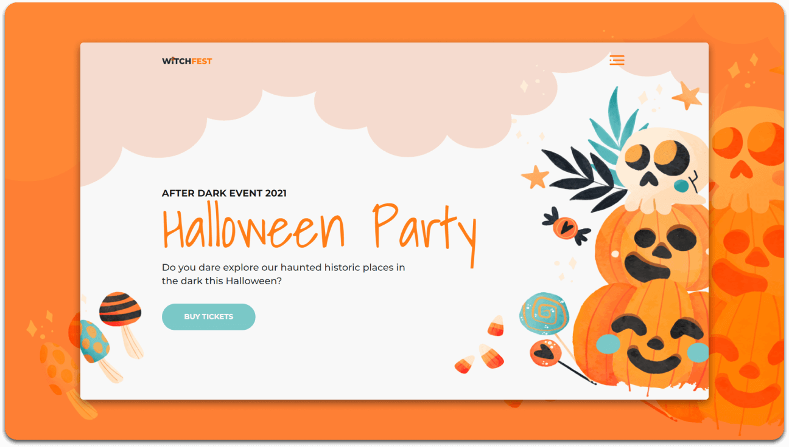

  
   
   

  <h2 align="center">Halloween - Landing Page</h2>

  Halloween is a fully responsive landing page,  Responsive for all devices, build using HTML, CSS, and JavaScript.

  <a href="https://codewithsadee.github.io/halloween/"><strong>➥ Live Demo</strong></a>

 

### Demo Screeshots

### Prerequisites

Before you begin, ensure you have met the following requirements:

* [Git](https://git-scm.com/downloads "Download Git") must be installed on your operating system.
